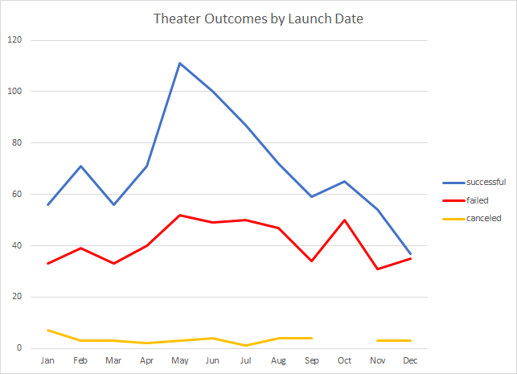
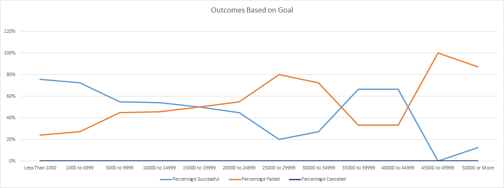

# Kickstarting with Excel

## Overview of Project

### Purpose
Help Louise analyze crowdfunding data to increase the chances of making her campaign succesful
## Analysis and Challenges

### Analysis of Outcomes Based on Launch Date

Based on the chart, we can see that the number of succesful productions are highest in May and June. This information might seem very helpful but can be misleading without other information.  If the number of failures is just as high during May and June we could not conclude that this is the best time to launch a campaign. However, We can see that the average number of failures is independent of the time of the year. Therefore, we can clude that the best time for Louise to start a campaign would be during the months of May or June

### Analysis of Outcomes Based on Goals
With a budget of around $10,000-11,000, we can see that Louise falls in the $10,000 to $15,000. The success rate for campaigns with this budget is only 54%. To increase her success rate Louise can either raise her goal to $35,000 to increase her success rate to 67% or lower her goal to under $5000 to increase her success rate to 73% or 76%. 

### Challenges and Difficulties Encountered
Gathering the data and presenting presented no challenges. It is clear that Louise should start her campaign in either May or June. It is a little unclear however, whether Louise should lower, raise, or keep her goal. Every kickstarer will be different. I believe the data here has too much variance and coming to a conclusion here would be difficult.

## Results

  1. The best time to launch is during the months of May and June with success rates of 67% and 65%
  2. December is the worst time to launch, with the only month having a success rate of under 50% at 49%

I think we can safely say the smaller a goal is, the more likely it is to be accomplished. You can see this with our data.The success rate starts off        high and trends downwards as the goal increases. There is an increase in success rate between the $35,000 and $50,000 goal but I believe this is a good time to use our best judgment and see that there are instances where we can be succesful with higher goals, but this could possibly be due to the volatile nature of kickstarters. This is a limitation of the dataset.

One more thing we could analyze would be the time alloted for the campaigns. Could the length of the campaign affect its success rate?
